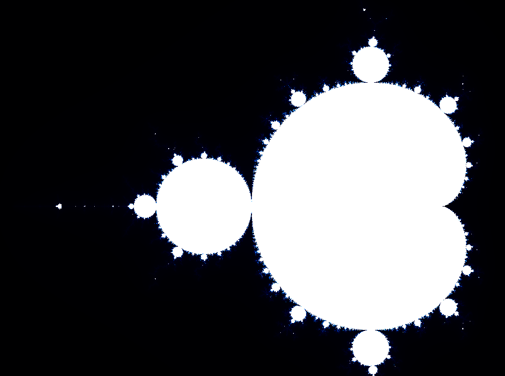

# simple-mandelbrot-visualiser
A simple visualisation of the mandelbrot set implemented in OpenGL. The calculations are done in GLSL, therefore in the GPU, which accelerates the process compared to a implementation on the CPU.

The mandelbrot set, according to the definition on Wikipedia is:

The Mandelbrot set is the set of complex numbers $c$ for which the function $$f_{c} ( z ) = z^{2} + c$$ does not diverge when iterated from $$z = 0$$

In the visualisation of the mandelbrot set, the x and y position are taken as the real and imaginary component of c, thus making the visualisation possible.

The figure about shows the zoomed out overview of the mandelbrot set.

This is a the figure zoomed in at coordinate $$(-0.748348181, 0.1)$$ (no particular reason why that was chosen, it just looks nice there).